# Smooth Boolean Operators for Meshes

## Contact Info
- __Name:__ Giorgio De Magistris
- __Email:__ giorgiodema@gmail.com
- __Blender Chat:__ giorgiodema
- __GitHub:__ [github.com/giorgiodema](https://github.com/giorgiodema/)
- __ShaderToy:__ [shadertoy.com/user/dema](https://www.shadertoy.com/user/dema)

## Synopsis
This project consists in implementing a new Modifier that allows to perform smooth boolean operations (boolean operations with smooth trainsitions). The same implementation can be easily extended to introduce another Modifier to round an object (softening the edges and corners) by just adjusting a single parameter that controls the amount of roundness. These operations cannot be easily achieved with meshes while their implementation is straightforward using implicit surfaces and in particular Signed Distance Fields (SDF). This representation is not commonly used in 3D modelling softwares since meshes allow to model arbitrary shapes and to apply textures much more easily.
The aim of this proposal is to bring these functionalities (boolean operations with smooth transitions and rounding) to the mesh domain. I already implemented a prototype in Python, available [here](https://github.com/giorgiodema/Smooth-Boolean-Operations-for-Meshes). The most important challenge of this project is to make the method efficient enough for real-time visualization. Some solutions are proposed in the dedicated section. The figure below shows an example of smooth union with different degree of smoothness.

  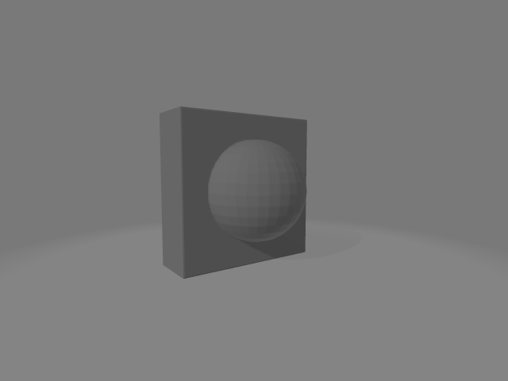
  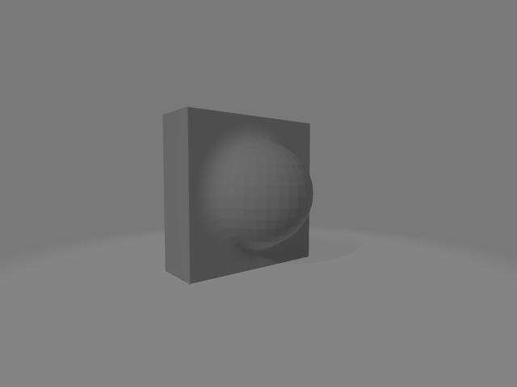
  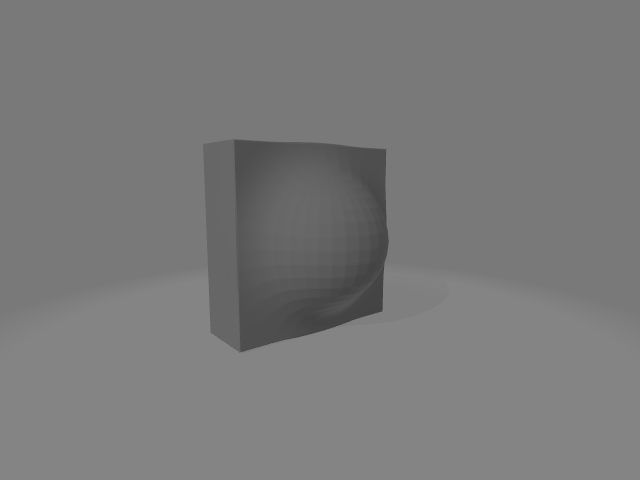

An example of rounding is shown here, where the roundness progressively increases from left to right:

  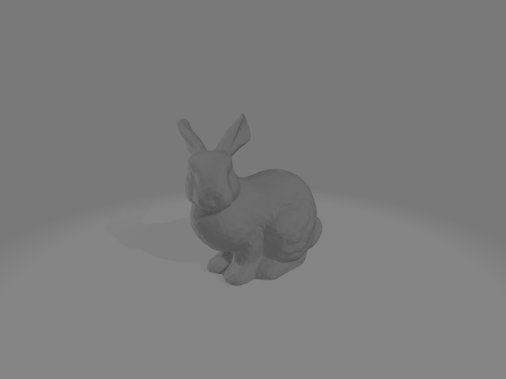
  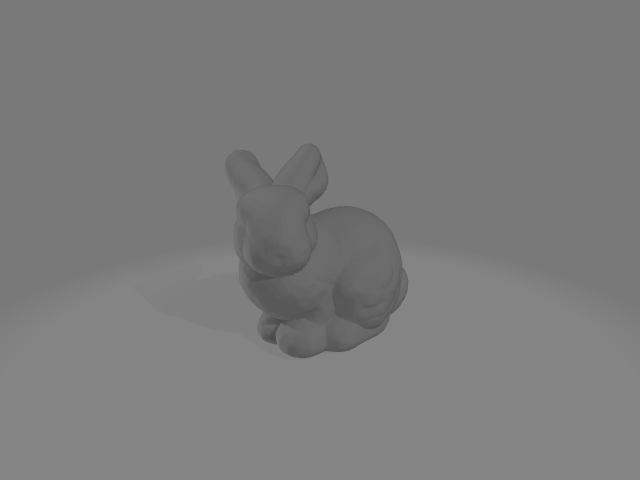
  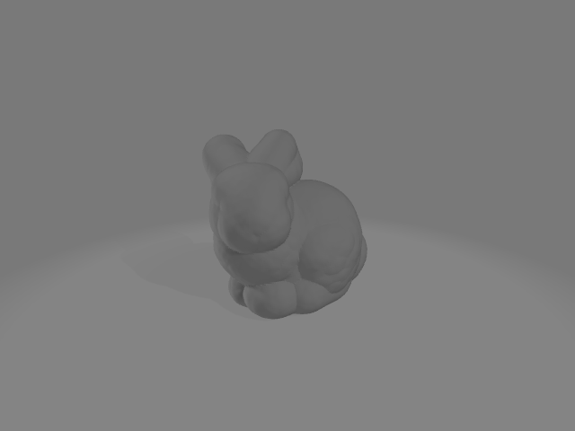

## Benefits
This project greatly facilitates the modelling process, introducing operations that cannot be easily reproduced with existing techniques. The most similar feature actually implemented in Blender is Metaballs, that allows to softly fuse simple geometric primitives (similarly to the smooth union and difference presented here), where the influence of one primitive over the other is controlled by the stiffness parameter (similarly to the smoothness parameter of the proposed method). But it is limited to a small set of primitives (Ball, Capsule, Plane, Ellipsoid, Cube). The new feature presented here allows to extend this workflow to any shape. 
Moreover, in Blender, applying boolean operations on non-watertight meshes often leads to unpredictable results, as also stated in the [official documentation](https://docs.blender.org/manual/en/latest/modeling/modifiers/generate/booleans.html). On the other hand, the method introduced here demonstrates resilience against such inputs.
The figure shows from left to right: the non watertight mesh (there are visible holes on the bottom), union and difference with smoothness set to zero.

  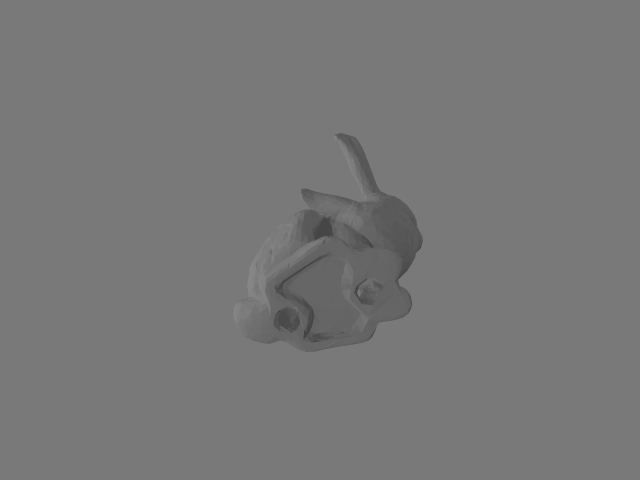
  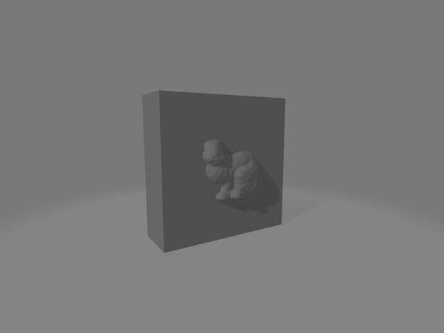
  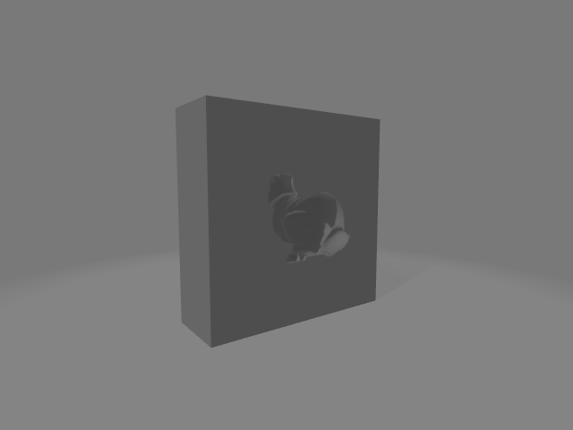

The second feature presented in this project, the process of smoothing the edges and corners of an object, can be achieved in Blender using the Subdivision Surface Modifier or the Bevel tool. However the amount of roundness that can be obtained by subdividing a surface is limited. The second approach requires expertise and manual work to obtain the desired result. On the other hand, the technique presented here requires just the tuning of the roundness parameter to control the desired amount of roundness. 

## Project Details
The soft boolean operators and the rounding operator are implemented converting the input meshes into a Signed Distance Field represented as a volumetric grid. Before that, an axis-aligned bounding-box that encapsulates the mesh for unary operators, or the two meshes for binary operators, is computed. This allows to mantain the position, orientation and scale of the obects (including the relative position and orientation for binary operators). After that the boolean operators are applied independently to each element of the grid (or the grids for binary operators). The result of the operations is given as a volumetric grid than is then converted back to a mesh with the Marching Cubes algorithm (or a more efficient version of it, like [this one](https://www.tandfonline.com/doi/abs/10.1080/10867651.2003.10487582)).

### Optimizations
The prototype presented [here](https://github.com/giorgiodema/Smooth-Boolean-Operations-for-Meshes) takes a few seconds to compute the operations using a grid with medium resolution. That implementation already employs a BVH to accelerate the point-mesh distance queries but it does not leverage data parallelism.  Each step of the pipeline indeed ( the conversion of the mesh into a voxel grid, the computation of the boolean operations and the conversion back from voxel grid to mesh)  allows data parallelism, since the algorithms operate independently on each element of the grid. Hence a parallel implementation of the algorithm can drastically reduce the running time, allowing to run the method in real-time. This is important to provide an instant feedback to the user when the modifier is applied.

Another important aspect is the resolution of the grid. The prototype implementation uses a fixed resolution, but it can be greatly improved by varying the resolution according to some heuristics. For example the grid can be recursively subdivided according to the number of points or triangles in the current voxel. The benefit of this approach are manifold, since it allows both to save computation where the geometry is coarse and to preserve the details at the expense of computational cost where the geometry is more detailed.

## Deliverables
The outcome of this project is the introduction of two new Modifiers: `Smooth Boolean` and `Rounding`. 

The interface of the `Smooth Boolean` is similar to the existing `Boolean` modifier but it introduces two new parameters: `Smoothness` (expressed in actual distance units) and `Resolution` that controls the resolution of the grid. It could be decided not to expose the second parameter to the user, expecially if the method is implemented with an adaptive resolution grid, as described in the previous section. A mockup of the user interface of the modifier is shown below.

  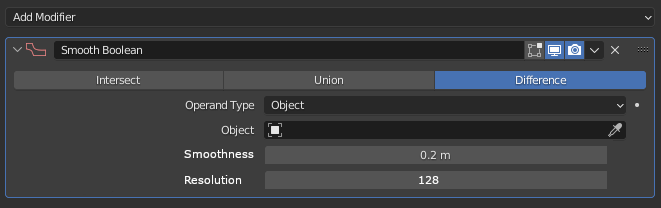

The interface of the `Rounding` modifier has only two parameters: `Roundness` that controls the amount of smoothness, expressed in distance units and `Resolution`, that as in the previous example, controls the resolution of the grid. Also in this case it could be decided to consider this second parameter as an implementation detail and hide it to the user. A mockup of the user interface of the modifier is shown below.

  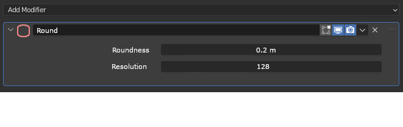

## Project Schedule
I am currently a PhD student in Computer Science. During the whole period of the summer of code, I have no important commitments and will be able to fully devote myself to the project .
|__Period__|__Details__|
|----------|----------|
| Community Bonding Period |<ul><li>I will know my Mentors and I will improve my proposal according to their guidance</li><li> I will also continue studying the Blender codebase and try to make small contributions to familiarize with the environment</li></ul> |
| Week 1 - 6 | I will implement the operations (smooth booleans and rounding) using the Blender API. In this phase I will not deal with the UI yet, but I will implement the core functions using the BLI API and no other external dependency. This phase can be further subdivided into the following steps: <ul><li> <b>week 1: </b> Design of the interfaces and implementation of unit tests</li><li> <b>week 2-4: </b>Actual implementation of the functions</li><li> <b>week 5-6: </b>Data parallelization, using either CUDA (if available) or multithreading</li></ul>|
| Week 7 - 8| Implementation of the UI. In this phase I will implement the new modifiers (Smooth Boolean and Rounding) and integrate them in the Blender UI. |
| Week 9| Integration tests |
| Week 10-11| I will produce the documentation and tutorials |
| Week 12| Buffer |

## Bio
I am a third year PhD student in Engineering in Computer Science at Sapienza University of Rome. I am mainly interested in Computer Graphics and Machine Learning, and actually I am working on differentiable rendering and image based surface reconstruction. I am new to Blender development but I have experience in Computer Graphics and I am proficient in C/C++, shader programming (OpenGL/GLSL), Python and CUDA. I am also doing my best to get into the Blender codebase, to gain as much experience as possible before the start of the Summer of Code.
In the past I mainly used Blender for research purposes, but its great number of features wet my appetite and I started to learn more about its use for content creation. It would be a great pleasure for me to contribute to this awsome software by having the opportunity to learn from experienced programmers.