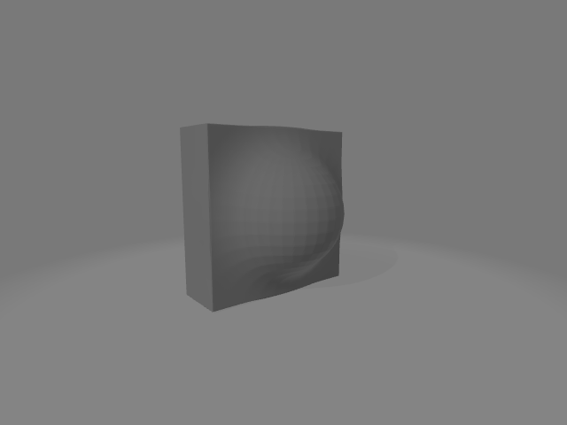
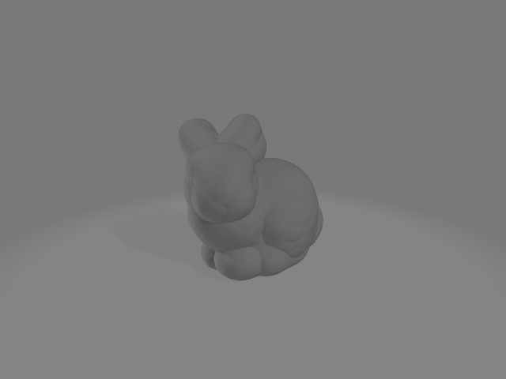
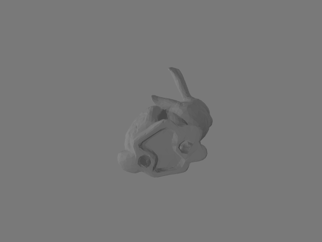
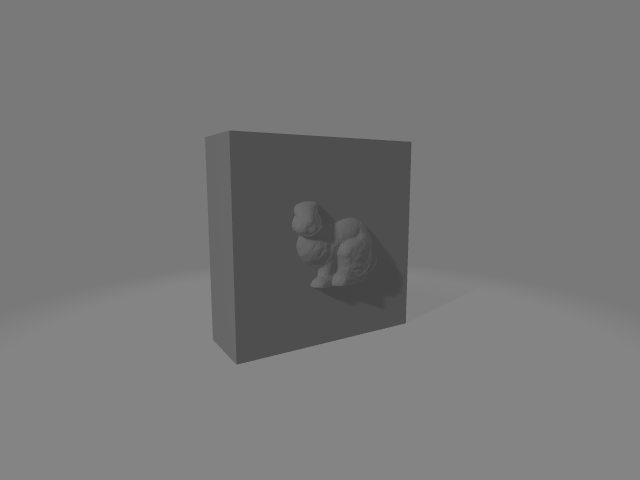
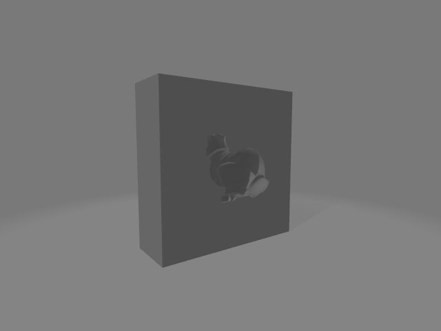

# Smooth Boolean Operations for Meshes
This repo introduces an innovative approach to compute boolean operations on meshes (union, intersection and difference). Unlike traditional methods, our approach offers smooth variants of the boolean operations and supports non-watertight meshes. It works by converting meshes into Signed Distance Fields (SDFs) represented as volume grids, facilitating boolean operations in this alternative representation. The smooth boolean operations are adapted from techniques shared by Íñigo Quílez on his [website](https://iquilezles.org/articles/distfunctions/), specifically tailored for implicit functions represented as SDFs.

## Boolean Operations

In the subsequent sections, we compare traditional boolean operations with their smooth counterparts, varying the degree of smoothness through the smoothness parameter. This parameter dictates the extent of the smooth transition between two primitives, measured in actual distance units. Initially, boolean operations compute an axis-aligned bounding box that encapsulates both operands to maintain their relative positions. This box is divided into a grid, the resolution of which is determined by the resolution parameter. While higher resolutions capture more detail, they also increase computation time. Additionally, the pad parameter indicates the amount of padding added to each dimension of the grid, essential for some smooth operations where the resultant mesh slightly exceeds the size of the original meshes.

The code examples below demonstrate how to perform basic and smooth boolean operations, leveraging the smoothness parameter to control the outcome's smoothness level.

### Prerequisites
- pymesh2==0.3
- Meshes should be in Wavefront obj format, located in the data folder.
- Results will be saved in the tmp folder, also in obj format.

### Union
The following code snippet computes the union and the smooth union with smoothness parameter equal to 0.4 and 0.8 between a box and a sphere, the resulting 
meshes are shown in the images below.
```python
import pymesh
import boolean

m1 = pymesh.load_mesh("data/box_1.obj")
m2 = pymesh.load_mesh("data/sphere_1.obj")

# Basic union
u = boolean.union(m2, m1, resolution=128)

# Smooth unions with varying smoothness
su1 = boolean.smoothUnion(m2,m1,smoothness=0.4,resolution=128,pad=10)
su2 = boolean.smoothUnion(m2,m1,smoothness=0.8,resolution=128,pad=10)

pymesh.save_mesh("tmp/u.obj",u)
pymesh.save_mesh("tmp/su1.obj",su1)
pymesh.save_mesh("tmp/su2.obj",su2)
```
<p align="center">
  
  
  
</p>


### Difference
The following code snippet computes the difference and the smooth difference with smoothness parameter equal to 0.4 and 0.8 between a box and a sphere, the resulting 
meshes are shown in the images below.
```python
# Basic difference
d = boolean.subtraction(m2,m1,resolution=128)

# Smooth differences with varying smoothness
sd1 = boolean.smoothSubtraction(m2,m1,smoothness=0.4,resolution=128,pad=10)
sd2 = boolean.smoothSubtraction(m2,m1,smoothness=0.8,resolution=128,pad=10)

pymesh.save_mesh("tmp/d.obj",d)
pymesh.save_mesh("tmp/sd1.obj",sd1)
pymesh.save_mesh("tmp/sd2.obj",sd2)
```
<p align="center">
  
  
  
</p>

### Intersection
The following code snippet computes the intersection and the smooth intersection with smoothness parameter equal to 0.4 and 0.8 between a box and a sphere, the resulting 
meshes are shown in the images below.
```python
# Basic intersection
i = boolean.intersection(m2,m1,resolution=128)

# Smooth intersections with varying smoothness
si1 = boolean.smoothIntersection(m2,m1,smoothness=0.4,resolution=128,pad=10)
si2 = boolean.smoothIntersection(m2,m1,smoothness=0.8,resolution=128,pad=10)

pymesh.save_mesh("tmp/i.obj",i)
pymesh.save_mesh("tmp/si1.obj",si1)
pymesh.save_mesh("tmp/si2.obj",si2)
```
<p align="center">
  
  
  
</p>

## Rounding
Beyond boolean operations, implicit surfaces facilitate manipulations that are challenging to achieve directly on meshes, such as rounding. Traditionally, rounding on meshes might involve subdividing the surface or utilizing the bevel tool in 3D editing software, both of which demand design proficiency and careful adjustment for the desired outcome. In contrast, Signed Distance Fields simplify the rounding process by merely adjusting to a level set greater than zero. The round function presented here only requires a roundness parameter, which specifies the degree of rounding in actual distance units. The example below demonstrates the rounding of the Stanford bunny model at roundness values of 0, 0.1, and 0.2, with the resultant images displayed below.
```python
bunny = pymesh.load_mesh("data/bunny.obj")

# rounding with varying roundness
r1 = boolean.round(bunny,roundness=0.1,resolution=128,pad=20.)
r2 = boolean.round(bunny,roundness=0.2,resolution=128,pad=25.)

pymesh.save_mesh("tmp/r1.obj",r1)
pymesh.save_mesh("tmp/r2.obj",r2)
```
<p align="center">
  
  
  
</p>

## Non Watertight Meshes
In Blender, applying boolean operations on non-watertight meshes often leads to unsatisfactory outcomes. However, the method introduced here demonstrates resilience against such inputs. The following example illustrates the boolean difference applied to a box and the Stanford bunny, which notably contains holes at its base, as depicted in the accompanying image.
```python
bunny1 = pymesh.load_mesh("data/bunny_1.obj")

# boolean operation on non watertight mesh
nw = boolean.subtraction(bunny1,m1,resolution=128)

pymesh.save_mesh("tmp/nw.obj",nw)
```
The figure shows from left to right: the non watertight mesh, the operands, the result of the boolean opearation.
<p align="center">
  
  
  
</p>